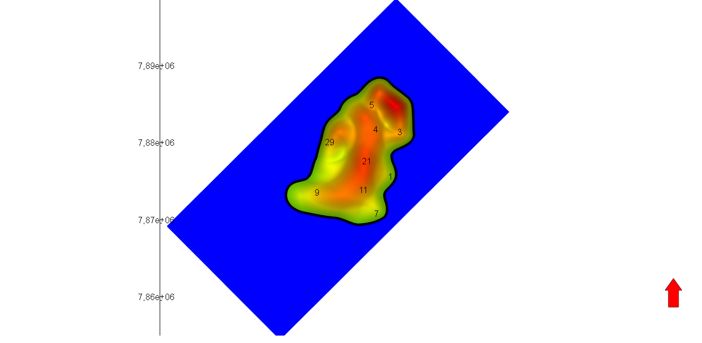
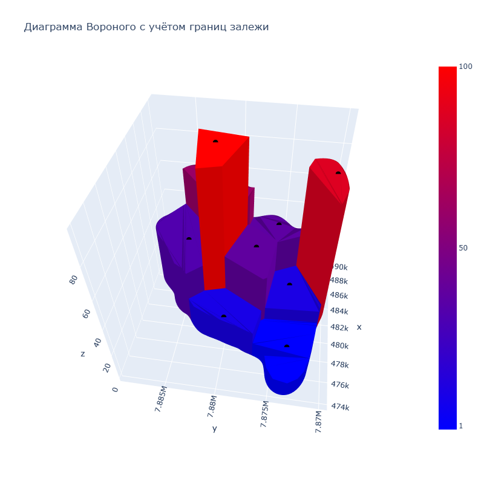

# Voronoi Diagrams 

Проект для построения диаграмм Вороного с использованием Python, Plotly и Geovoronoi.

## Установка

### 1. Клонирование репозитория
```bash
git clone https://github.com/Ostap2002-arch/Voronoi_diagrams.git
cd Voronoi_diagrams
```

### 2. Установка библиотек
```bash
pip install -r requirements.txt
```

## Данные для создания диаграммы
С данными, на основе которых был сделан демонстрационный пример,
находятся в border.txt и wells.txt.
### Данные границы контура (border.txt)
Информация представляет собой импортированные данные замкнутого 
многоугольника из тНавигатор.
```bash
X1 Y1 Z1
X2 Y2 Z2
........
Xn Yn Zn
```
### Данные скважин (wells.txt)
Информация представляет собой импортированные данные 
множества точек из тНавигатор.
```bash
X1 Y1
X2 Y2
.....
Xn Yn
```

## Запуск программы
По умолчанию поиск данных будет происходить внутри проекта в файлах 
border.txt и wells.txt. Запуск производится с корня проекта:
```bash
python main.py
```
После чего в веб браузере откроется диаграмма Вороного

Если есть необходимость, при запуске можно указать пути
к данным, и нужный тип диаграммы (2d или 3d), по умолчанию строится 
2d диаграмма
```bash
python main.py --border border.txt --wells wells.txt ----graph 3d
```
## Пример работы
На фотографии представлен Расположение скважин и контура сбоку.

Расположение скважин и контура сверху.


2d Диаграмма Вороного к этим данным

3d Диаграмма Вороного к этим данным



